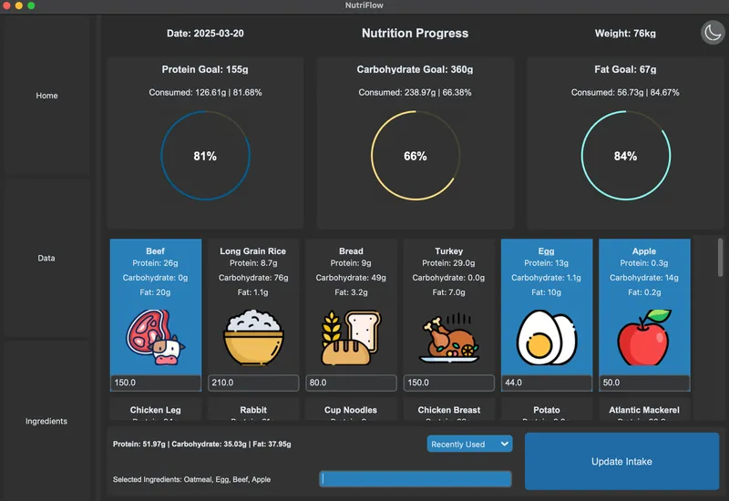
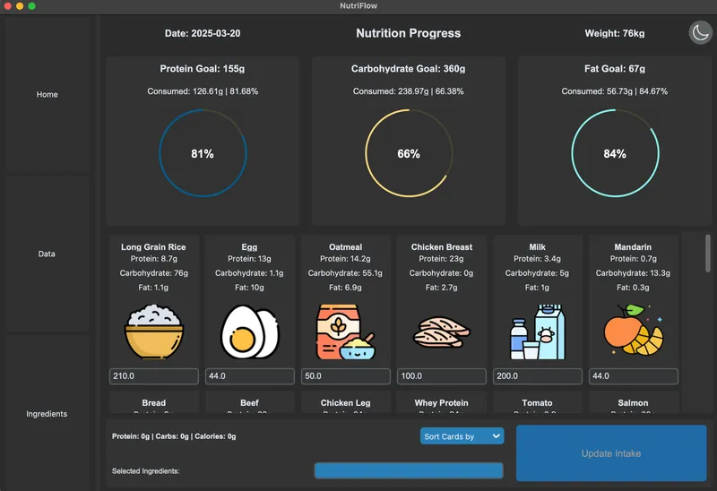
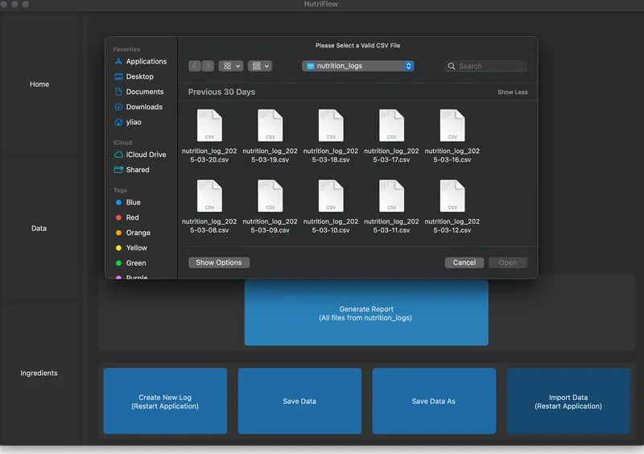
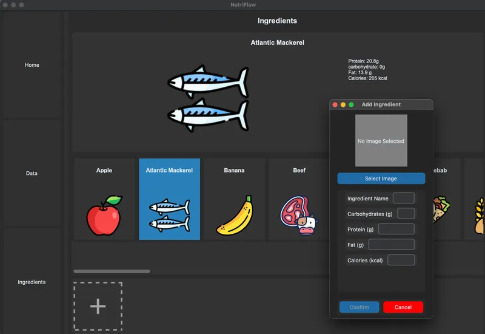
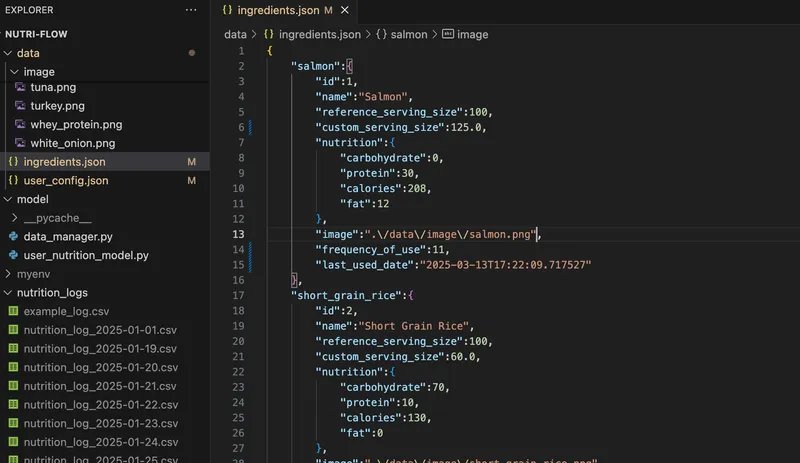
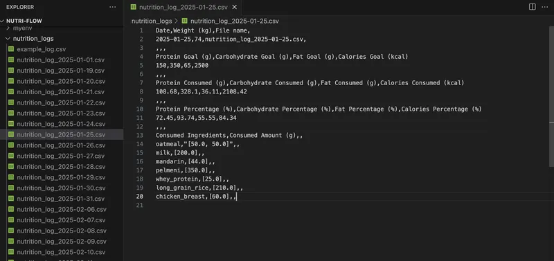
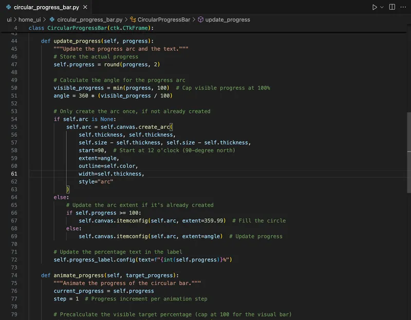

# Nutri Flow

🥦 **Nutri Flow** is a lightweight and intuitive desktop nutrition tracker built with Python and Tkinter.  
Designed for both general users and fitness enthusiasts, it offers a clean, form-based UI to log meals, calculate intake, and monitor eating habits over time — all fully offline.

---

## ✨ Key Features

- 🧾 Clean and minimal form-based interface (zero learning curve)
- 🗂️ CSV-based data storage for transparency and control
- 📚 JSON-driven ingredient library and user configuration
- 📆 Weekly and monthly report export (no external database needed)
- 🚫 Fully offline and distraction-free experience

## 📸 Screenshots

<p align="center">
  
  
  
  
  
  
  
  

## </p>

---

## 🚀 Tech Stack

- **Language:** Python 3
- **GUI Framework:** Tkinter
- **Storage:** CSV (for entries), JSON (for config/ingredients)

---

## 📂 Project Structure

```bash
.
├── app.py
├── config.py
├── data
│   ├── image
│   ├── ingredients.json
│   └── user_config.json
├── images
│   └── thumbs
├── LICENSE
├── model
│   ├── __pycache__
│   ├── data_manager.py
│   └── user_nutrition_model.py
├── myenv
│   ├── bin
│   ├── include
│   ├── lib
│   └── pyvenv.cfg
├── nutrition_logs
│   ├── example_log.csv
│   ├── nutrition_log_2025-01-01.csv
├── README.md
├── reset.py
├── ui
│   ├── __pycache__
│   ├── data_ui
│   ├── home_ui
│   ├── ingredients_ui
│   ├── sidebar_frame.py
│   └── splash_screen.py
├── utils
├── venv
│   ├── bin
│   ├── include
│   ├── lib
│   └── pyvenv.cfg
└── viewmodel
    ├── __pycache__
    └── nutrition_viewmodel.py
```

---

## 📌 Purpose

This project was developed from scratch as a personal tool to understand nutrition with clarity and ease.  
It reflects a design philosophy focused on **practicality, maintainability, and user-first simplicity** — free from feature bloat, yet flexible enough for real-world tracking.

---

## 📜 License

Licensed under the [MIT License](LICENSE).
